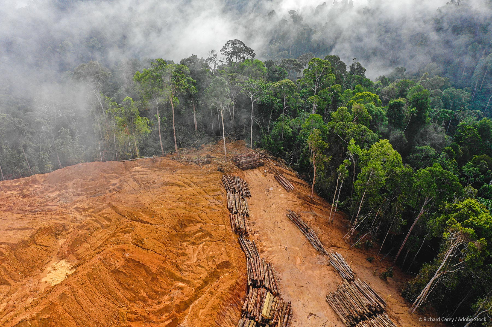
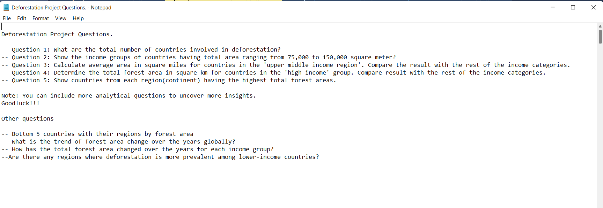
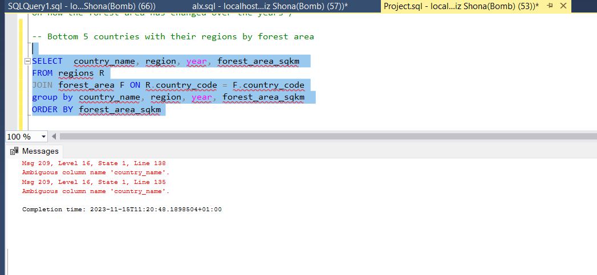

# .⛈️ SQL-Deforestation-analysis-project .⛈️ 

### This is a project to get data from the database with data related to deforestation and answer questions with it.

## **DATA SOURCE**

THIS DATA CAN BE GOTTEN FROM [HERE]()

## **SKILLS AND CONCEPTS DEMONSTRATED**
- SubQueries
- CTEs
- Aggregation
- Joins

## **QUESTIONS**

## **SOLUTIONS AND RESULTS**

THIS CAN BE FOUND [HERE](https://github.com/mhizshona/SQL-Deforestation-analysis-project/blob/main/project.md).

###3 okay okay

ADDDING THIS HERE JUST CAUSE

Apparently i got this error cause the country_name column existed in the two tables so SQL was confused from which table to pull results from,
it got solved when i used an alias to specify which table it should pick from.

THATS AlL FOR NOW, THANK YOU. 🙂
